# 目录理解

```bash
.
├── applications
├── arkcompiler
├── base
├── build
├── build.py -> build/build_scripts/build.py
├── build.sh -> build/build_scripts/build.sh
├── commonlibrary
├── developtools
├── device	# 具体的硬件平台（与OS无关），定义物理硬件特性，包含硬件所需的驱动程序
│   └── {硬件种类，board  qemu  soc}/
│	 └── {具体的平台，riscv32_virt riscv64_virt x86_64_virt...}/
│     └── {设备名, riscv32_virt}/
│      ├── BUILD.gn                     # 设备级构建脚本，指定riscv32_virt
│      ├── example.md                   # 挂载FAT文件的示例文档
│      ├── liteos_m                     # LiteOS-M 内核实现
│      │   ├── board                    # 板级支持包 (BSP)，
│      │   ├── BUILD.gn                 # LiteOS-M 构建脚本
│      │   ├── config.gni               # LiteOS-M 配置
│      │   ├── gen_fs                   # 文件系统生成工具
│      │   └── hdf_config               # 硬件驱动框架配置
│      ├── ohos.build                   # OpenHarmony 构建描述文件
│      ├── README.md                    # 英文说明文档
│      └── README_zh.md                 # 中文说明文档
├── docs
├── domains
├── drivers
├── foundation
├── ide
├── interface
├── kernel
├── napi_generator
├── out
├── prebuilts
├── productdefine
├── qemu-run -> vendor/ohemu/common/qemu-run
├── test
├── third_party
└── vendor	# 针对特定应用场景的软件解决方案（使用OS,	定义系统功能组合）
│   └── {厂家，hihope  hisilicon  ohemu}/
│	 └── {具体的平台，qemu_riscv32_mini_system_demo  qemu_x86_64_linux_min...}/
│     └── {产品名, qemu_riscv32_mini_system_demo}/
        ├── ace_lite_config/             # ACE Lite 配置
        ├── BUILD.gn                     # 产品构建脚本，指定了qemu_riscv32_mini_system_demo
        ├── config.json                  # 产品配置文件
        ├── fs_data/                     # 文件系统数据
        ├── fs-storage.img               # 文件系统镜像
        ├── graphic_config/              # 图形配置
        ├── hals/                        # 硬件抽象层实现
        ├── kernel_configs/              # 内核配置
        ├── LICENSE                      # 许可证
        ├── ohos.build                   # OpenHarmony 构建描述
        ├── qemu_run.sh                  # QEMU 启动脚本
        └── tests/                       # 测试用例
```


产品：是包含一系列部件的集合，编译后产品的镜像包可以运行在不同的开发板上。

'virt’ Generic Virtual Platform

内核对外API建议采用LOS_ModuleFunc的形式，如果有宾语则建议采用前置的方式，比如：

```c
LOS_TaskCreate
LOS_MuxLock
```

kernel目录下内部模块间的接口使用OsModuleFunc的形式，比如：

```c
OsTaskScan
OsMuxInit
```

### device

HDF 是 OpenHarmony 的**硬件抽象层框架**，全称为 Hardware Driver Foundation。

HDF（Hardware Driver Foundation）是OpenHarmony硬件驱动框架，为硬件厂商提供统一的驱动接口和开发框架。

在OpenHarmony中，HDF使用HCS（HDF Configuration Source）配置硬件信息，实现驱动与配置解耦。


### vendor


# Ubuntu 虚拟机环境下

## build/prebuilts_download.sh 报错

cp: cannot stat '/openharmony/prebuilts/clang/ohos/linux-x86_64/llvm/include': No such file or directory


``` bash
wget https://mirrors.huaweicloud.com/harmonyos/compiler/clang/15.0.4-7e44be/linux/clang_linux-x86_64-7e44be-20241220.tar.gz
sudo tar -xzvf clang_linux-x86_64-7e44be-20241220.tar.gz -C ~/opt
cp -r clang_linux-x86_64-7e44be-20241220/include ~/ohos/openharmony/prebuilts/clang/ohos/linux
-x86_64/llvm
```

## hb build 报错

1. `/bin/sh: 1: riscv32-unknown-elf-gcc: not found`

   riscv32代表32位指令集，elf代表裸机运行

   下载，解压，创建软链接：

   ```bash
   wget https://mirrors.huaweicloud.com/harmonyos/compiler/gcc_riscv32/7.3.0/linux/gcc_riscv32-linux-7.3.0.tar.gz
   sudo tar -xzvf gcc_riscv32-linux-7.3.0.tar.gz -C ~/opt
   ln -s /opt/gcc_riscv32/riscv32-unknown-elf /usr/local/bin/riscv32-unknown-elf-gcc
   ```

   编辑环境变量：

   ```bash
   # 编辑 ~/.bashrc
   sudo vim ~/.bashrc
   # 在最后添加以下文本（路径为你安装编译链的路径）
   export PATH=~/gcc_riscv32/riscv32-unknown-elf-gcc/bin:$PATH
   # 使环境变量生效
   source ~/.bashrc
   # 验证
   riscv32-unknown-elf-gcc -v
   ```

2. `regist_llvm_objcopy_path failed`

   

   ```bash
   wget https://mirrors.huaweicloud.com/harmonyos/compiler/clang/15.0.4-7e44be/linux/clang_linux-x86_64-7e44be-20241220.tar.gz
   sudo tar -xzvf clang_linux-x86_64-7e44be-20241220.tar.gz -C ~/opt
   cp -r clang_linux-x86_64-7e44be-20241220/bin ~/ohos/openharmony/prebuilts/clang/ohos/linux
   -x86_64/llvm
   ```
   

## openharmony/qemu-run 报错

1. `cat: ohos_config.json: No such file or directory`

   ohos_config.json在 out 文件夹下。

   ```bash
   cp out/ohos_config.json .
   ```

2. `pthread_exit:515`

   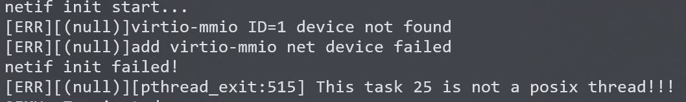

   未解决。在社区也有人提了Issue。

   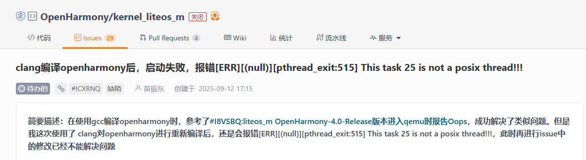
   
   转到 docker 后出现同样的错误。尝试更改Qemu的启动选项：
   
   ```bash
   > qemu-system-riscv32 -M virt -m 128M -bios none \
     -kernel out/riscv32_virt/qemu_riscv_mini_system_demo/OHOS_Image \
     -global virtio-mmio.force-legacy=false \
     -device virtio-blk-device,drive=hd0 \
     -drive file=vendor/ohemu/qemu_riscv32_mini_system_demo/fs-storage.img,format=raw,id=hd0 \
     -device virtio-net-device,netdev=net0 \
     -netdev user,id=net0 \
     -device virtio-gpu-device,xres=800,yres=480 \
     -device virtio-tablet-device \
     -nographic \
     -append "root=/dev/vda console=ttyS0"
   ```
   
   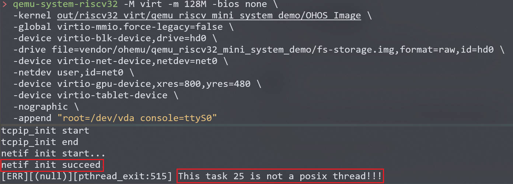
   
   `netif init succeed!`（virtio 设备已就绪），成功后依然出现相同的错误。也就是说程序里有地方在**非 POSIX 线程（即 LiteOS 的内核/普通任务）上下文中调用了 `pthread_exit`**，而系统的 POSIX 封装检测到这种误用并报错。这个错误不会把线程正常结束（或会触发未定义行为），所以表现为“异常/卡死”或服务退出。

##  riscv32-unknown-elf-gdb

1. `libncursesw.so.5: cannot open shared object file: No such file or directory`

   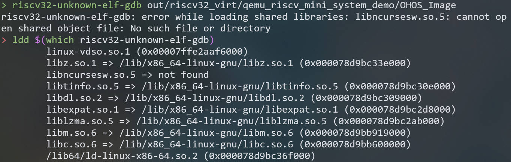

   ```bash
   sudo apt install libncurses5
   ```

   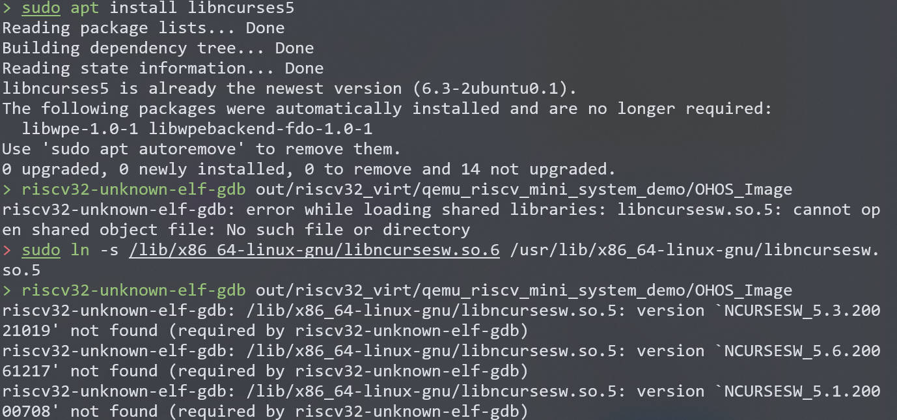

   默认下载的是最新版的`libncurses6.3`，版本不匹配，下一步从镜像网站拉取旧版本。

   虚拟机版本为ununtu22.04只能使用`libncurses6.3`，使用鸿蒙官方提供的docker镜像ubuntu20.04可解决此问题。

# Docker 环境下

```bash
# 获取轻量系统镜像
docker pull swr.cn-south-1.myhuaweicloud.com/openharmony-docker/docker_oh_mini:3.2

# 进入OpenHarmony源码根目录执行如下命令，将当前目录映射到容器的/home/openharmony目录
docker run -it -v $(pwd):/home/openharmony swr.cn-south-1.myhuaweicloud.com/openharmony-docker/docker_oh_mini:3.2

# 安装repo，将repo添加到环境变量（repo 是下载源码使用，上面已经将虚拟机中的源码映射到了Docker中）
curl https://gitee.com/oschina/repo/raw/fork_flow/repo-py3 -o /home/tools/repo
chmod a+x /home/tools/repo
echo 'export PATH=/home/tools/repo:$PATH' >> /root/.bashrc
source  /root/.bashrc

# 安装 hb，以及需要的依赖
python3 -m pip install --user build/hb
apt update
apt-get install -y default-jdk gcc-arm-none-eabi genext2fs libtinfo5 mtools 

bash build/prebuilts_download.sh

hb set
hb build -f
```

注意，到docker环境下编译环境需要重新安装。

## python3 build.py -p qemu_riscv_mini_system_demo@ohemu 报错

`python3 build.py -p qemu_riscv_mini_system_demo@ohemu`就等价与`hb set`选择好目标再`hb build`。

1. 在编译 `hc-gen`工具时，链接器无法找到必要的 C++ 标准库符号。错误信息显示缺少 `__libc_single_threaded`和 `std::__throw_bad_array_new_length`等符号定义

   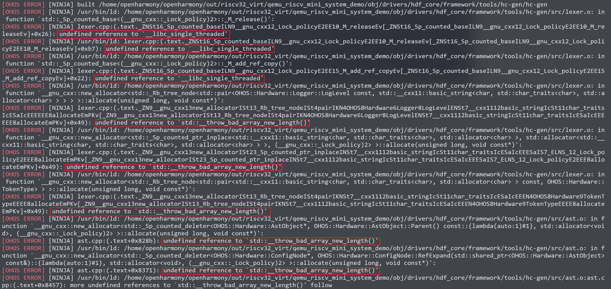

   避坑：hb clean 不会删除 //out/riscv32_virt。在 ubuntu 和 docker 切换时需要手动删除。

# Qemu 

## 安装

```bash
# 安装依赖
apt install build-essential zlib1g-dev pkg-config libglib2.0-dev  binutils-dev libboost-all-dev autoconf libtool libssl-dev libpixman-1-dev virtualenv flex bison

# 下载源码，并解压
wget https://download.qemu.org/qemu-6.2.0.tar.xz
tar -xf qemu-6.2.0.tar.xz

# 本地编译
cd qemu-6.2.0
mkdir build && cd build
../configure --prefix=qemu_installation_path # 自行指定安装地址
make -j16
make install

#添加环境变量, 最末尾加入: export PATH=$PATH:qemu_installation_path
echo 'export PATH=/home/tools/qemu-6.2.0-install:$PATH' >> ~/.bashrc
source ~/.bashrc
```

## GDB

在一个窗口中输入命令：

```
./qemu-run -g
```

在另一个窗口中输入命令：

```
riscv32-unknown-elf-gdb out/riscv32_virt/qemu_riscv_mini_system_demo/OHOS_Image
(gdb) target remote localhost:1234
(gdb) b main
```

# 调试解决错误

## openharmony/qemu-run报错: pthread_exit:515

device/qemu/riscv32_virt/liteos_m/board/main.c：main() --> SystemAdapterInit()

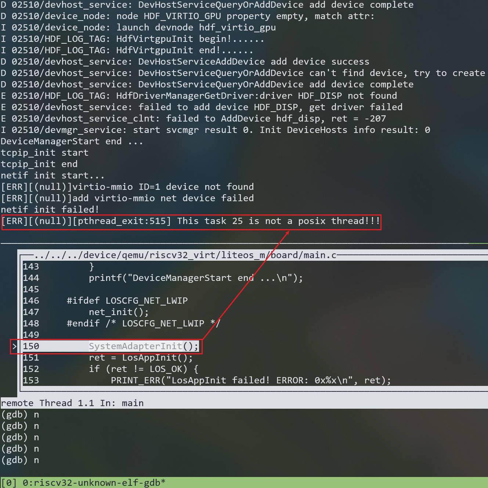

device/qemu/riscv32_virt/liteos_m/board/libc/utils.c: SystemAdapterInit() --> mount(NULL, "/data", "littlefs", 0, littlefsConfig);

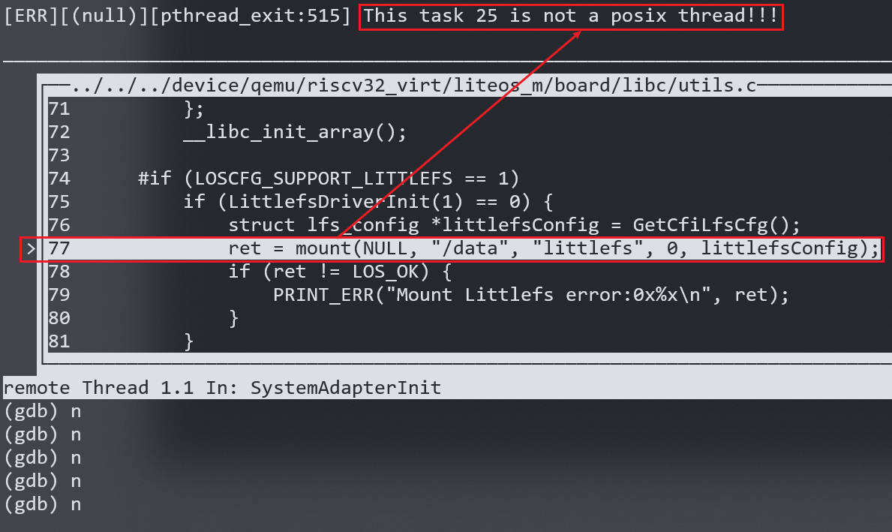

kernel/liteos_m/components/fs/vfs/vfs_mount.c: mount() --> mp->mFs->fsMops->mount(mp, mountflags, data);

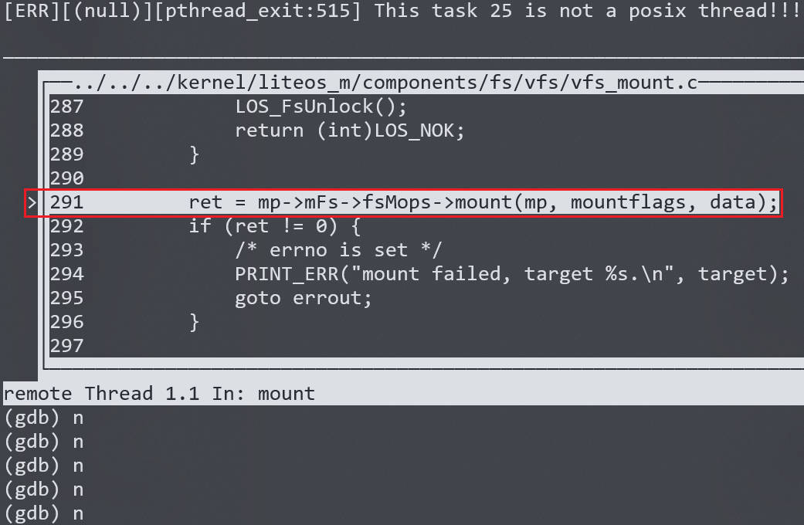

mp->mFs->fsMops->mount(mp, mountflags, data) 实际调用的是 LfsMount() 

kernel/liteos_m/components/fs/littlefs/lfs_adapter.c: LfsMount() --> lfs_mount((lfs_t *)mp->mData, cfg)

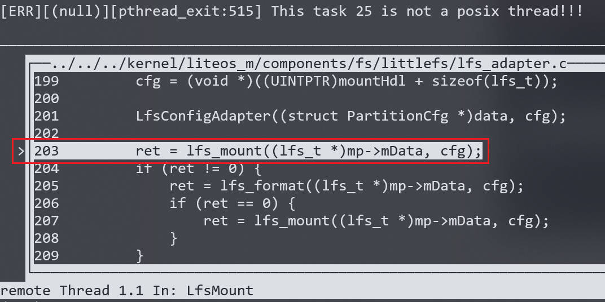

third_party/littlefs/lfs.c: lfs_mount() --> lfs_rawmount()

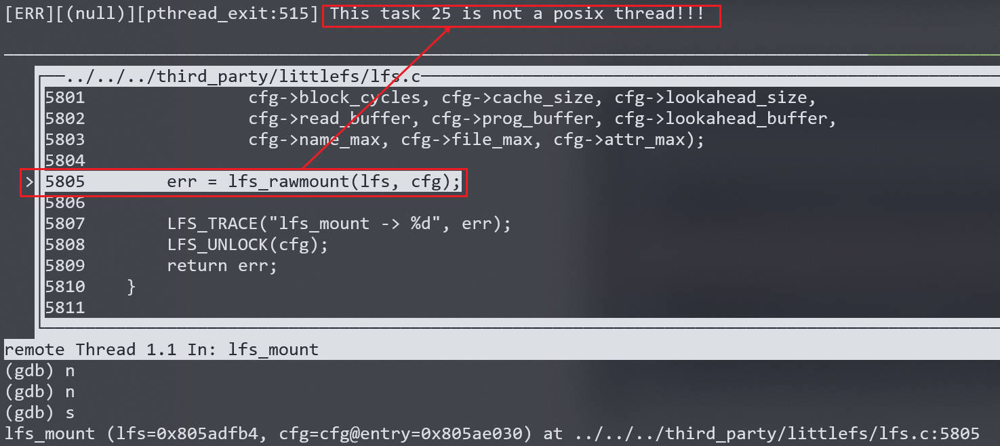

third_party/littlefs/lfs.c: lfs_rawmount() --> lfs_init()

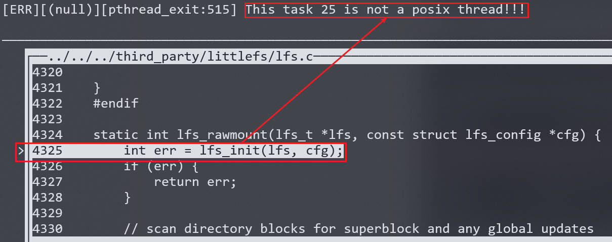

third_party/littlefs/lfs.c: lfs_init()

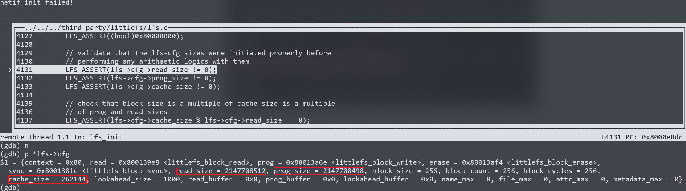

`lfs->cfg`中的各项值明显异常。与`/device/qemu/riscv32_virt/liteos_m/board/driver/cfiflash/cfiflash_fs_hal.c`中的定义值不同。

解决方式：

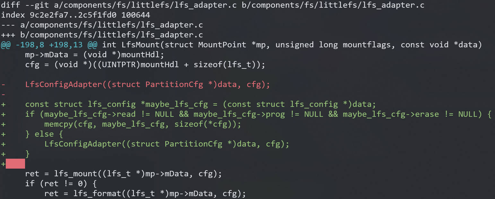

```c
// kernel/liteos_m/components/fs/littlefs/lfs_adapter.c: LfsMount()
const struct lfs_config *maybe_lfs_cfg = (const struct lfs_config *)data;
if (maybe_lfs_cfg->read != NULL && maybe_lfs_cfg->prog != NULL && maybe_lfs_cfg->erase != NULL) {
    memcpy(cfg, maybe_lfs_cfg, sizeof(*cfg));
} else {
    LfsConfigAdapter((struct PartitionCfg *)data, cfg);
}

// LfsConfigAdapter((struct PartitionCfg *)data, cfg);
```

## LittleFS 镜像制作工具

系统已经继续启动，但 LittleFS 报了一个**元数据损坏**的错误信息：

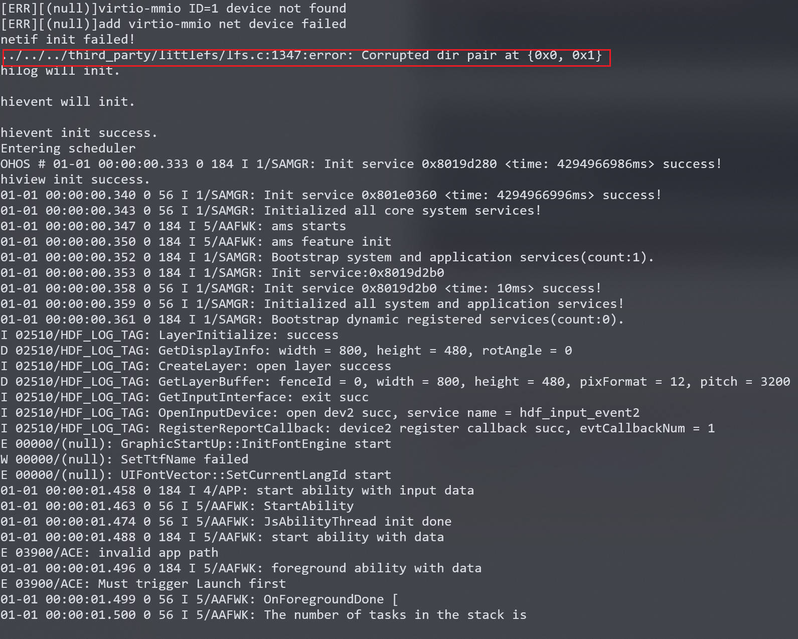

`LiteOS-M`中使用的文件系统`LittleFS`版本是2.8.0，但是镜像打包工具`mklittlefs`版本较低，与`LittleFS`版本不匹配。改用适配的版本的`mklittlefs`，具体做法：在 github 中下载较新版本的`mklittlefs`，在`mklittlefs`目录下再拉取`LittleFSv2.8.0`,重新编译。

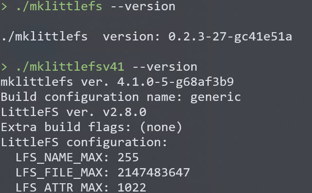

存在一个问题，新编译的`/mklittlefsv41`中依赖一些三方库不支持ubuntu20.04。

# OHOS

1. 找不到根目录 `/`

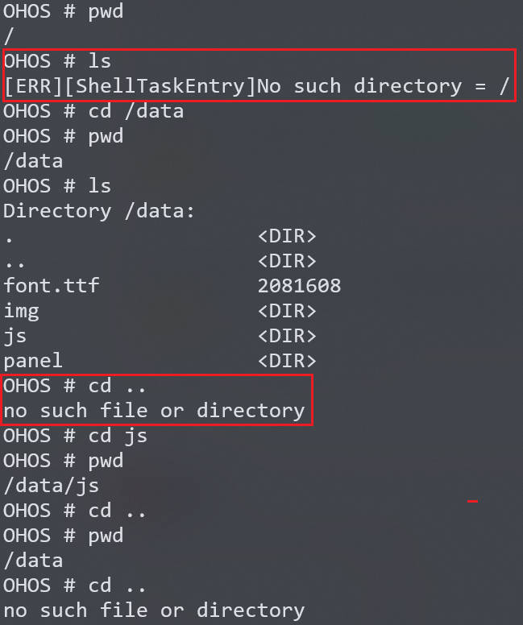


# LiteOS-M 系统镜像构建过程

`out/riscv32_virt_ubuntu/qemu_riscv_mini_system_demo/obj/kernel/liteos_m/liteos.ninja`

### 1. 链接器核心参数

```
ldflags = 
  -static                       # 静态链接
  -Wl,--gc-sections             # 移除未使用段
  -Wl,-Map=OHOS_Image.map       # 生成内存映射
  -mabi=ilp32                   # RISC-V ABI
  -falign-functions=2           # 函数对齐
  -march=rv32imac               # 目标架构
  -T liteos.ld                  # 关键：链接脚本
  -L./libs                      # 库文件路径
  --whole-archive -lbootstrap   # 强制包含整个库
  -nostartfiles                 # 不使用标准启动文件
```

### 2. 链接脚本 (`liteos.ld`)

指定了链接脚本 -T /home/hw/ohos/openharmony/device/qemu/riscv32_virt/liteos_m/board/liteos.ld 


riscv32-unknown-elf/bin/ld: cannot find -lunwind

lunwind不支持riscv32？？

LOSCFG_KERNEL_BACKTRACE=y


 

# 如何使用LiteOS-M


## LiteOS-M能力测试

测试文件接口

- [ ] 测试文件接口
- [ ] 


# OpenHiTLS迁移


```
协议层 (Protocol Layer)
    ↓
核心层 (CORE)
    ↓
MATH_LIB (TpmBigNum 抽象接口)
    ↓
具体实现: wolf / openssl(ossl) / custom
    ↓
平台层 (Platform Layer)
```

例子：

/home/hw/hw3tpm/tpm/src/crypt/ecc/TpmEcc_Signature_SM2.c : 中调用  `ExtMath_AddWord`

`ExtMath_AddWord`在/home/hw/hw3tpm/tpm/cryptolibs/common/include/MathLibraryInterface.h 中声明

在/home/hw/hw3tpm/tpm/cryptolibs/TpmBigNum/TpmBigNumThunks.c中实现 调用 `BnAddWord`

 `BnAddWord` 在/home/hw/hw3tpm/tpm/cryptolibs/TpmBigNum/include/BnMath_fp.h 声明，提供给上层

在/home/hw/hw3tpm/tpm/cryptolibs/TpmBigNum/BnMath.c 中实现


```
┌────────────────────────────────────────────┐
│                TPM Command Layer           │
│--------------------------------------------│
│  e.g., TPM2_Startup(), TPM2_CreatePrimary()│
│  调用 TPM_Core 中的加密操作                │
└────────────────────────────────────────────┘
                     │
                     ▼
┌────────────────────────────────────────────┐
│              TPM Core / Crypto Interface   │
│--------------------------------------------│
│  文件：                                    │
│   - CryptoInterface.h                      │
│   - MathLibraryInterface.h                 │
│                                            │
│  定义抽象接口：                            │
│   - Crypto_HashStart(), Crypto_HashData()  │
│   - Math_BnAdd(), Math_BnMod(), …          │
└────────────────────────────────────────────┘
                     │
                     ▼
┌────────────────────────────────────────────┐
│                Ossl 适配层                 │
│--------------------------------------------│
│  文件：                                    │
│   - BnToOsslMath.c/.h                     │
│   - TpmToOsslSupport.c                    │
│   - TpmToOsslSym.h / TpmToOsslHash.h      │
│   - BnOssl.h                              │
│                                            │
│  功能：封装 TPM 内部接口到 OpenSSL 调用     │
│                                            │
│  示例：                                    │
│   - Math_BnAdd() → BN_add()               │
│   - Crypto_HashStart() → EVP_DigestInit() │
│   - Crypto_SymEncrypt() → EVP_EncryptInit()│
└────────────────────────────────────────────┘
                     │
                     ▼
┌────────────────────────────────────────────┐
│               OpenSSL 库 (libcrypto)       │
│--------------------------------------------│
│  提供底层加密实现：                        │
│   - 大数：BN_*                             │
│   - 哈希：EVP_Digest*                      │
│   - 对称：EVP_Cipher*                      │
│   - ECC/RSA：EC_KEY_*, RSA_*              │
└────────────────────────────────────────────┘
```


```
.
├── common
│   ├── CMakeLists.txt
│   └── include
│       ├── CryptoInterface.h			
│       ├── EccConstantData.inl
│       ├── MathLibraryInterface.h	定义了MATH_LIB抽象层的完整接口，wolf/ossl/custom必须实现的统一接口
│       └── MathLibraryInterfaceTypes.h 核心抽象类型（大数、点、ECC参数），初始化和释放（需要实现：ExtMath_*）
├── Ossl
│   ├── BnToOsslMath.c
│   ├── CMakeLists.txt
│   ├── include
│   │   ├── BnOssl.h
│   │   └── Ossl
│   │       ├── BnToOsslMath_fp.h
│   │       ├── BnToOsslMath.h
│   │       ├── CMakeLists.txt
│   │       ├── TpmToOsslHash.h
│   │       ├── TpmToOsslSupport_fp.h
│   │       └── TpmToOsslSym.h
│   └── TpmToOsslSupport.c
└── TpmBigNum
    ├── BnConvert.c
    ├── BnEccConstants.c
    ├── BnMath.c
    ├── BnMemory.c
    ├── BnUtil.c
    ├── CMakeLists.txt
    ├── include
    │   ├── BnConvert_fp.h
    │   ├── BnMath_fp.h
    │   ├── BnMemory_fp.h
    │   ├── BnSupport_Interface.h
    │   ├── BnUtil_fp.h
    │   ├── BnValues.h
    │   └── TpmBigNum
    │       └── TpmToTpmBigNumMath.h
    ├── TpmBigNum.h
    └── TpmBigNumThunks.c
```

大小端：

+ openHitls  可选 --endian
+ tpm2 v183 big endian
+ liteos-m  HelloApp: Little Endian Detected


### 适配 tpm/cryptolibs/common/include/MathLibraryInterface.h

1. LIB_EXPORT *int* ExtMath_LibInit(*void*);

   在`tpm/cryptolibs/TpmBigNum/TpmBigNumThunks.c`中实现：

   ```c
   // Called when system is initializing to allow math libraries to perform
   // startup actions.
   LIB_EXPORT int ExtMath_LibInit(void)
   {
       return BnSupportLibInit(); // 
   }
   ```

   `BnSupportLibInit（）`:

   + `tpm/cryptolibs/TpmBigNum/include/BnSupport_Interface.h`中，接口声明（抽象层）：

   + ```c
     //** BnSupportLibInit()
     // This function is called by CryptInit() so that necessary initializations can be
     // performed on the cryptographic library.
     LIB_EXPORT int BnSupportLibInit(void);
     ```

   + `tpm/cryptolibs/Ossl/include/Ossl/TpmToOsslSupport_fp.h`中，实现声明（具体实现层）：

   + ```c
     //*** BnSupportLibInit()
     // This does any initialization required by the support library.
     LIB_EXPORT int BnSupportLibInit(void);
     ```

   + `tpm/cryptolibs/Ossl/TpmToOsslSupport.c`中实现：

   + ```c
     //*** BnSupportLibInit()
     // This does any initialization required by the support library.
     LIB_EXPORT int BnSupportLibInit(void)
     {
         return TRUE;
     }
     ```

   + 需要在HITLS适配层中添加实现声明、实现

2. LIB_EXPORT BOOL ExtMath_Debug_CompatibilityCheck(*void*);

   在`tpm/cryptolibs/TpmBigNum/TpmBigNumThunks.c`中实现：

   ```c
   //** MathLibraryCompatibililtyCheck()
   // This function is only used during development to make sure that the library
   // that is being referenced is using the same size of data structures as the TPM.
   LIB_EXPORT BOOL ExtMath_Debug_CompatibilityCheck(void)
   {
       return BnMathLibraryCompatibilityCheck();
   }
   ```

   `BnMathLibraryCompatibilityCheck()`:

   + `tpm/cryptolibs/TpmBigNum/include/BnSupport_Interface.h`中，声明：

   + ```c
     //** MathLibraryCompatibililtyCheck()
     // This function is only used during development to make sure that the library
     // that is being referenced is using the same size of data structures as the TPM.
     BOOL BnMathLibraryCompatibilityCheck(void);
     ```

   + `/tpm/cryptolibs/Ossl/BnToOsslMath.c`中实现

   + ```c
     #  if LIBRARY_COMPATIBILITY_CHECK
     
     //*** MathLibraryCompatibilityCheck()
     BOOL BnMathLibraryCompatibilityCheck(void)
     {
         OSSL_ENTER();
         BIGNUM*       osslTemp = BnNewVariable(CTX);
         crypt_uword_t i;
         BYTE test[] = {0x1F, 0x1E, 0x1D, 0x1C, 0x1B, 0x1A, 0x19, 0x18, 0x17, 0x16, 0x15,
                        0x14, 0x13, 0x12, 0x11, 0x10, 0x0F, 0x0E, 0x0D, 0x0C, 0x0B, 0x0A,
                        0x09, 0x08, 0x07, 0x06, 0x05, 0x04, 0x03, 0x02, 0x01, 0x00};
         BN_VAR(tpmTemp, sizeof(test) * 8);  // allocate some space for a test value
                                             //
         // Convert the test data to a bigNum
         BnFromBytes(tpmTemp, test, sizeof(test));
         // Convert the test data to an OpenSSL BIGNUM
         BN_bin2bn(test, sizeof(test), osslTemp);
         // Make sure the values are consistent
         GOTO_ERROR_UNLESS(osslTemp->top == (int)tpmTemp->size);
         for(i = 0; i < tpmTemp->size; i++)
             GOTO_ERROR_UNLESS(osslTemp->d[i] == tpmTemp->d[i]);
         OSSL_LEAVE();
         return 1;
     Error:
         return 0;
     }
     #  endif
     ```

     + 用于检查自定义的BigNum实现与OpenSSL的BIGNUM是否兼容

     + `OSSL_ENTER`:

       ```c
       // tpm/cryptolibs/Ossl/include/Ossl/BnToOsslMath.h
       #define OSSL_ENTER() BN_CTX* CTX = OsslContextEnter()
       
       // tpm/cryptolibs/Ossl/TpmToOsslSupport.c
       //*** OsslContextEnter()
       // This function is used to initialize an OpenSSL context at the start of a function
       // that will call to an OpenSSL math function.
       BN_CTX *OsslContextEnter(void)
       {
           BN_CTX *CTX = BN_CTX_new();
           //
           return OsslPushContext(CTX);
       }
       
       
       ```

     


```c
LIB_EXPORT BOOL ExtEcc_IsPointOnCurve(const Crypt_Point *Q, const Crypt_EccCurve *E) {                 
	return BnIsPointOnCurve((pointConst)Q, AccessCurveConstants(E));                                   }

typedef CRYPT_POINT_BUF(pointone, 1) Crypt_Point;
#define CRYPT_POINT_BUF(buftypename, bits) BN_POINT_BUF(buftypename, bits)
#define BN_POINT_BUF(typename, bits)              \
    struct bnpt_st_##typename##_t                 \
    {                                             \
        bn_point_t coords;                        \
        BN_STRUCT(typename##_x, MAX_ECC_KEY_BITS) \
        x;                                        \
        BN_STRUCT(typename##_y, MAX_ECC_KEY_BITS) \
        y;                                        \
        BN_STRUCT(typename##_z, MAX_ECC_KEY_BITS) \
        z;                                        \
    }
#define BN_STRUCT_DEF(struct_type, count) \
    struct st_##struct_type##_t           \
    {                                     \
        crypt_uword_t allocated;          \
        crypt_uword_t size;               \
        crypt_uword_t d[count];           \
    }
typedef BN_STRUCT_DEF(bnroot, 1) bignum_t;
#ifndef bigNum
typedef bignum_t *bigNum;
typedef struct _bn_point_t
{
    bigNum x;
    bigNum y;
    bigNum z;
} bn_point_t;
typedef bn_point_t *bigPoint;
typedef const bn_point_t *pointConst;
```


https://wiki.0xffff.one/getting-started/build-env


